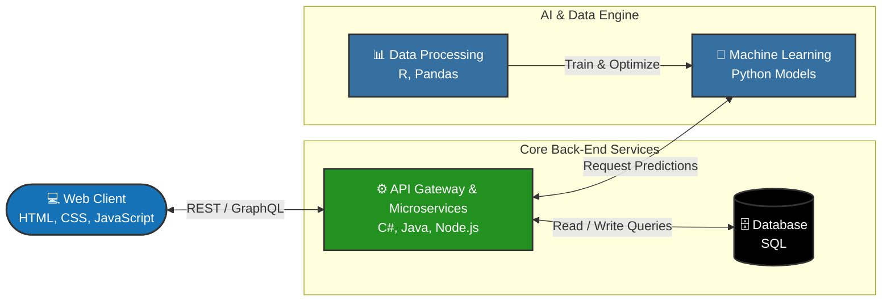

# Hi there 👋, I'm Hamed Payanda! 

**Full-Stack Software Developer | AI Developer**          

Welcome to my GitHub! I am a committed Full-Stack Software Developer who bridges the gap between intelligent data-driven systems and scalable web applications. I love building out complex back-ends, integrating AI models, and creating seamless user experiences.

  
  &nbsp;
  

 

### 👤 About Me

- 🔭 **I’m currently working on:** developing scalable Full-Stack web applications and integrating custom AI models to build smarter, data-driven software solutions.
- 🌱 **I’m currently learning:** advanced deployment strategies for machine learning models and optimizing back-end architecture for high-performance applications.
- 🤝  **I’m looking to collaborate on:** Open-source AI tools and innovative Full-Stack projects.
- 💬 **Ask me about:** Python, C#, JavaScript, back-end architecture, and integrating machine learning into applications.
- 📫 **How to reach me:** Let's connect on [LinkedIn](https://linkedin.com/in/YOUR-PROFILE-URL) or reach out via email at hamedpayanda@gmail.com.
- ⚡ **Fun fact:** My programming journey actually started by snapping together visual code blocks in Scratch, and today I'm building complex AI models and full-stack architectures!

---

### 🛠️ Tech Stack & Tools

**Programming Languages**
 

**Frameworks & Back-End Platforms** 
 

**AI, Data & Libraries** 
 

**DevOps & Tools**
 

---

### 🏗️ How I Build Systems (Full-Stack AI Architecture)

---

### 🏆 Featured Projects

* **[🧭 AI Career Coach](https://github.com/HAMED-PAYANDA/watsonx-gradio-career-coach)** - An interactive AI application suite featuring a resume polisher, cover letter generator, and career gap analyzer. Built using a Python/Gradio front-end integrated with IBM watsonx.ai (Meta Llama 4) cloud LLMs.

* **[🌐 Watsonx Voice Translator](https://github.com/HAMED-PAYANDA/watsonx-voice-translator)** - An end-to-end speech-to-speech translation web app that captures audio, translates contextually, and synthesizes speech. Built with a Python Flask backend, IBM Watson Speech Libraries (STT/TTS), watsonx.ai (Mistral), and containerized with Docker.

---

---

  

